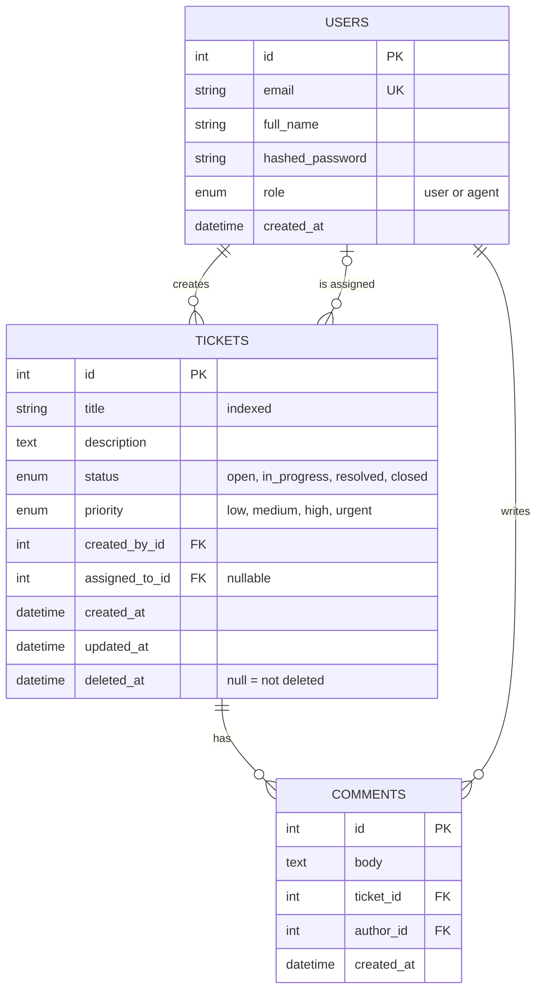

# mini-helpdesk
updated later

## Data model 

```mermaid
erDiagram
  USERS ||--o{ TICKETS : "creates"
  USERS |o--o{ TICKETS : "is assigned"
  TICKETS ||--o{ COMMENTS : "has"
  USERS ||--o{ COMMENTS : "writes"
  USERS {
    int id PK
    string email UK
    string full_name
    string hashed_password
    enum role "user or agent"
    datetime created_at
  }
  TICKETS {
    int id PK
    string title "indexed"
    text description
    enum status "open, in_progress, resolved, closed"
    enum priority "low, medium, high, urgent"
    int created_by_id FK
    int assigned_to_id FK "nullable"
    datetime created_at
    datetime updated_at
    datetime deleted_at "null = not deleted"
  }
  COMMENTS {
    int id PK
    text body
    int ticket_id FK
    int author_id FK
    datetime created_at
  }
```